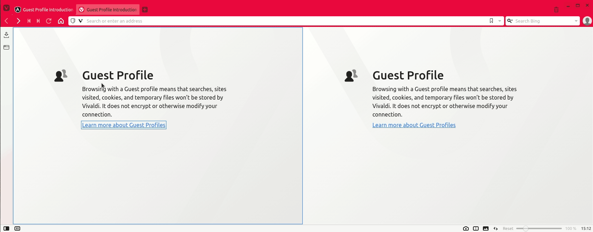

# planning-poker

This app allows teams to estimate task durations using
[planning poker](https://en.wikipedia.org/wiki/Planning_poker). All
participants select their estimates secretly and only discuss them after
they are revealed. If there is no consensus, the results are discussed
and the process can be reset and repeated.



## Tech stack

- [FastAPI](https://fastapi.tiangolo.com) (Python; backend)
- [Angular](https://angular.io) (Typescript/HTML/CSS; frontend)
- [MongoDB](https://www.mongodb.com) (NoSQL database)
- [Docker + Docker Compose](https://www.docker.com) (development environment)

## How to use

Currently the app can only be run locally. You will need to install 
[npm](https://www.npmjs.com) (version `6.14.15` was used during 
development but it was tested with version `7.24.1` as well),
[Docker](https://docs.docker.com/engine/install/) and 
[Docker Compose](https://docs.docker.com/compose/install/) (if it is not
already included in Docker).

After cloning this repository you can set up and run the app using
Docker Compose:
```bash
git clone git@github.com:ufeindt/planning-poker.git
cd planning-poker/frontend
npm install
cd ..
docker-compose up -d
```

This command will download all dependencies when it is first run and
start three containers for the app: `backend`, `frontend`, and
`mongodb`. You can check that everything is running `docker-compose ps`.

Next, open a new tab in your browser, navigate to http://localhost/ and 
start using the app. After creating a poll, you will likely want to open
another tab and use the shareable link to join the poll as a second
user.

When you are done, remember to shut down the Docker containers using:
```bash
docker-compose down
```

The backend API is exposed at http://localhost:8000/. For documentation
of the endpoints, visit http://localhost:8000/docs.

The database is exposed at port `27017` and can be accessed e.g. with 
[MongoDB Compass](https://www.mongodb.com/products/compass). The
username and password for the local instance are both `admin`.
